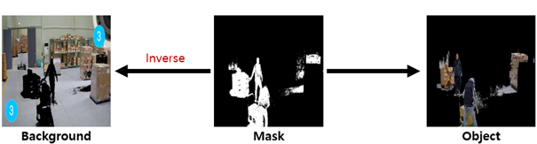
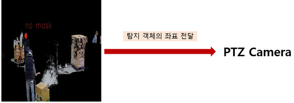
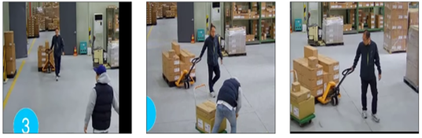
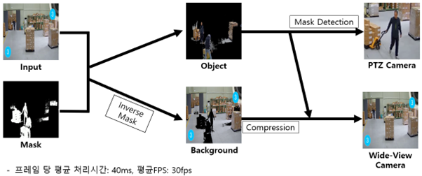

# 마스크 탐지 지능형 CCTV
#### 2017103962 김동규

## 시스템 설명
Main Camera는 Wide-View로 촬영하면서 감시 구역을 계속 촬영하고 마스크 탐지 기능을 추가한다. 마스크 미착용 인원이 감지될 경우, PTZ Sub-Camera가 미착용 인원을 추적하여 사람의 상시 감시 없이 자동으로 대응하는 시스템이다.

### 처리 순서
* 원본 영상에서 마스크로 객체와 배경 분리

</img>

* 객체 영상에서 마스크 탐지 중 미착용 인원 발견 시 좌표 전달

</img>

* PTZ 카메라로 추적

</img>

* Wide-angle view는 객체+배경 영상으로 기존과 동일

### 전체적인 구조
</img>

### Requirements
* yolov3, yolov4

## How to use
### Load weights
* Use settings/training.ipynb
~~~
!wget https://pjreddie.com/media/files/darknet53.conv.74
~~~

## About Models
Dataset
-----------------
* **mask** : 마스크 착용
* **improperly** : 턱 밑으로 내린 마스크
* **no mask** : 마스크 미착용

Image Sources
--------------
* Dataset: <https://drive.google.com/drive/folders/1aAXDTl5kMPKAHE08WKGP2PifIdc21-ZG>